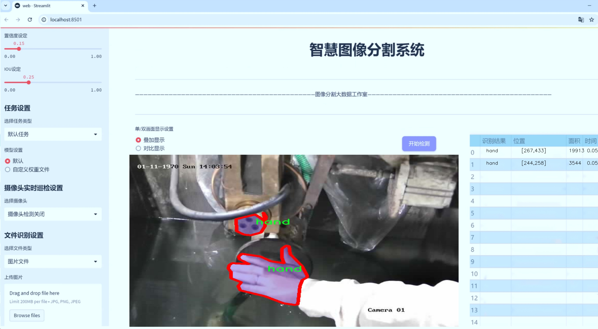
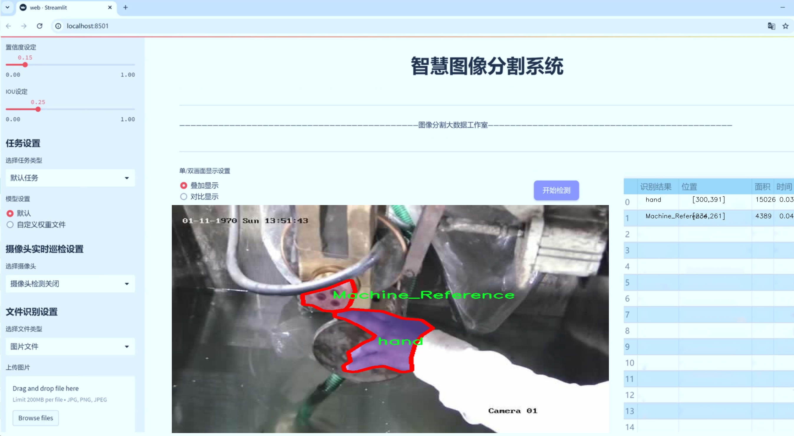
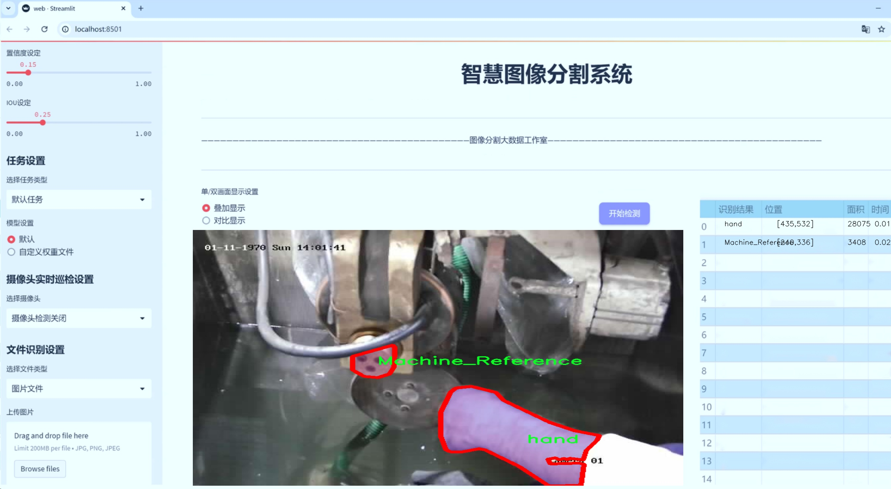
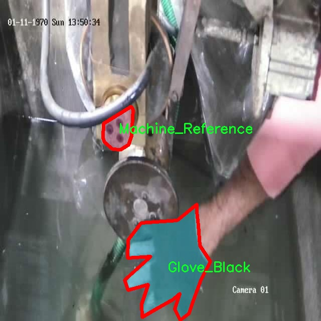
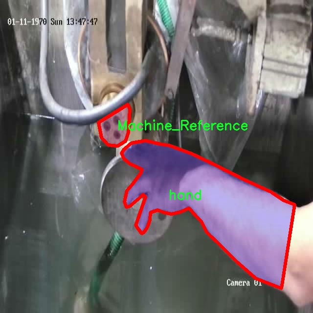
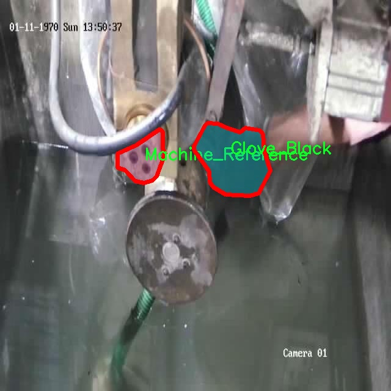
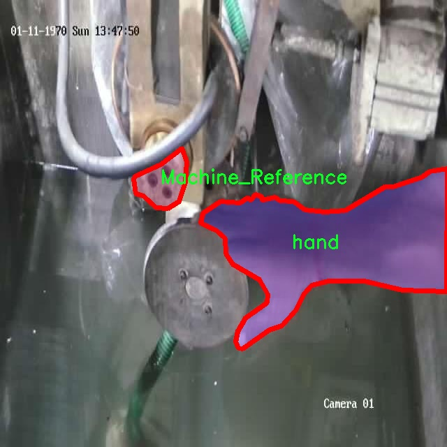
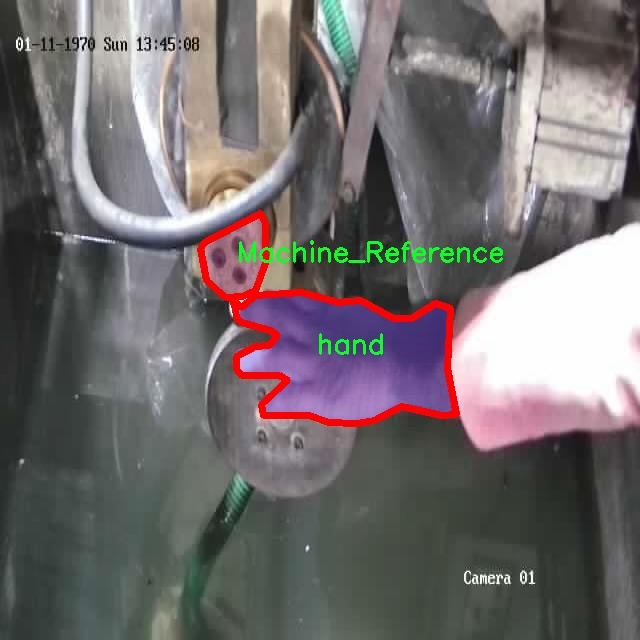

# 智慧车间手套与机器部件识别图像分割系统源码＆数据集分享
 [yolov8-seg-C2f-REPVGGOREPA＆yolov8-seg-goldyolo等50+全套改进创新点发刊_一键训练教程_Web前端展示]

### 1.研究背景与意义

项目参考[ILSVRC ImageNet Large Scale Visual Recognition Challenge](https://gitee.com/YOLOv8_YOLOv11_Segmentation_Studio/projects)

项目来源[AAAI Global Al lnnovation Contest](https://kdocs.cn/l/cszuIiCKVNis)

研究背景与意义

随着工业4.0时代的到来，智能制造逐渐成为全球制造业转型升级的重要方向。在这一背景下，智慧车间的建设不仅依赖于先进的生产设备，还需要高效的智能识别系统来提升生产效率和安全性。图像识别技术作为智能制造的重要组成部分，能够实现对生产环境中各类物体的自动识别与分类，从而为生产管理提供实时数据支持。尤其是在车间环境中，手套与机器部件的识别显得尤为重要，因为它们直接关系到工人的安全和生产的顺利进行。

在此背景下，基于改进YOLOv8的智慧车间手套与机器部件识别图像分割系统应运而生。YOLO（You Only Look Once）系列模型以其高效的实时检测能力和较高的准确率，成为目标检测领域的热门选择。YOLOv8作为该系列的最新版本，具备了更强的特征提取能力和更快的推理速度，能够满足智慧车间对实时性和准确性的双重需求。通过对YOLOv8模型的改进，结合特定的车间环境数据集，我们能够更好地实现对手套与机器部件的精准识别与分割。

本研究所使用的数据集“NEW_SEAM_LONI”包含1700张图像，涵盖了5个类别，包括黑色手套、白色手套、机器参考、黄色标记和手。这些类别的选择不仅反映了车间内常见的物品，还考虑到了工人操作过程中的安全隐患。例如，手套的颜色可以帮助识别不同的工作状态，而机器参考和黄色标记则是确保设备安全运行的重要标识。通过对这些类别的有效识别，我们能够实时监控车间内的安全状况，及时发现潜在的安全隐患，降低事故发生的风险。

此外，图像分割技术的引入使得系统不仅能够识别物体的类别，还能精确到物体的轮廓，这对于复杂的车间环境尤为重要。通过精确的图像分割，我们能够实现对手套和机器部件的精细化管理，提升车间的自动化水平和生产效率。研究表明，图像分割技术在工业应用中的推广能够显著减少人工干预，提高生产线的自动化程度，从而降低生产成本。

综上所述，基于改进YOLOv8的智慧车间手套与机器部件识别图像分割系统的研究，不仅具有重要的理论意义，也具备广泛的实际应用价值。通过提升车间内物体识别的智能化水平，我们能够为智能制造的实现提供有力支持，推动制造业的数字化转型进程。同时，该研究还为后续的相关技术开发和应用提供了宝贵的经验和数据支持，为智慧车间的全面建设奠定了坚实的基础。

### 2.图片演示







##### 注意：由于此博客编辑较早，上面“2.图片演示”和“3.视频演示”展示的系统图片或者视频可能为老版本，新版本在老版本的基础上升级如下：（实际效果以升级的新版本为准）

  （1）适配了YOLOV8的“目标检测”模型和“实例分割”模型，通过加载相应的权重（.pt）文件即可自适应加载模型。

  （2）支持“图片识别”、“视频识别”、“摄像头实时识别”三种识别模式。

  （3）支持“图片识别”、“视频识别”、“摄像头实时识别”三种识别结果保存导出，解决手动导出（容易卡顿出现爆内存）存在的问题，识别完自动保存结果并导出到tempDir中。

  （4）支持Web前端系统中的标题、背景图等自定义修改，后面提供修改教程。

  另外本项目提供训练的数据集和训练教程,暂不提供权重文件（best.pt）,需要您按照教程进行训练后实现图片演示和Web前端界面演示的效果。

### 3.视频演示

[3.1 视频演示](D:\Temporary)

### 4.数据集信息展示

##### 4.1 本项目数据集详细数据（类别数＆类别名）

nc: 4
names: ['Glove_Black', 'Glove_White', 'Machine_Reference', 'hand']


##### 4.2 本项目数据集信息介绍

数据集信息展示

在现代工业生产中，智慧车间的实现离不开高效的图像识别与分割技术。为此，我们构建了一个专门用于训练改进YOLOv8-seg的智慧车间手套与机器部件识别图像分割系统的数据集，命名为“NEW_SEAM_LONI”。该数据集的设计旨在提高对手套及机器部件的识别精度，确保在复杂的生产环境中能够快速、准确地进行物体检测与分割。

“NEW_SEAM_LONI”数据集包含四个主要类别，分别是“Glove_Black”、“Glove_White”、“Machine_Reference”和“hand”。这些类别的选择是基于实际生产环境中的常见物体，确保模型在训练后能够适应真实场景中的多样性和复杂性。首先，“Glove_Black”和“Glove_White”这两个类别代表了不同颜色的手套，手套在智慧车间中扮演着重要的角色，不仅是工人操作机器时的保护装备，也是识别工人身份的重要标志。通过对这两种手套的有效识别，系统能够实时监控工人的安全状态，并在必要时发出警报，确保生产安全。

其次，“Machine_Reference”类别则是针对车间内各种机器设备的标识。机器设备的识别对于智慧车间的自动化管理至关重要，能够帮助系统快速定位设备状态、进行故障检测以及优化生产流程。通过对这一类别的深入学习，模型将能够更好地理解机器与工人之间的互动关系，从而提升整体生产效率。

最后，“hand”类别的引入则是为了进一步增强系统的智能化水平。手部的识别不仅可以用于监测工人的操作行为，还可以与手套的识别相结合，提供更为全面的安全监控和操作分析。这种结合将使得系统能够更准确地判断工人在进行操作时是否佩戴了手套，从而减少潜在的安全隐患。

在数据集的构建过程中，我们确保每个类别的数据样本都具有足够的多样性和代表性。通过收集不同环境、不同光照条件下的图像，我们使得“NEW_SEAM_LONI”数据集不仅能够涵盖静态图像，还包括动态场景中的物体。这种多样性将极大地增强模型的泛化能力，使其在实际应用中表现出色。

此外，为了提高模型的训练效率和准确性，我们对数据集进行了精细的标注和处理。每张图像都经过严格的分割标注，确保每个类别的物体都能被清晰地识别和分割。这一过程不仅提升了数据集的质量，也为后续的模型训练奠定了坚实的基础。

总之，“NEW_SEAM_LONI”数据集的构建旨在为智慧车间的手套与机器部件识别提供强有力的支持。通过对四个关键类别的深入分析与标注，我们希望能够推动YOLOv8-seg模型在图像分割任务中的应用，进而提升智慧车间的自动化水平和安全性。随着数据集的不断完善与扩展，我们期待在未来的研究中，能够实现更高效、更智能的生产管理系统。











### 5.全套项目环境部署视频教程（零基础手把手教学）

[5.1 环境部署教程链接（零基础手把手教学）](https://www.bilibili.com/video/BV1jG4Ve4E9t/?vd_source=bc9aec86d164b67a7004b996143742dc)


[5.2 安装Python虚拟环境创建和依赖库安装视频教程链接（零基础手把手教学）](https://www.bilibili.com/video/BV1nA4VeYEze/?vd_source=bc9aec86d164b67a7004b996143742dc)

### 6.手把手YOLOV8-seg训练视频教程（零基础小白有手就能学会）

[6.1 手把手YOLOV8-seg训练视频教程（零基础小白有手就能学会）](https://www.bilibili.com/video/BV1cA4VeYETe/?vd_source=bc9aec86d164b67a7004b996143742dc)


按照上面的训练视频教程链接加载项目提供的数据集，运行train.py即可开始训练



     Epoch   gpu_mem       box       obj       cls    labels  img_size
     1/200     0G   0.01576   0.01955  0.007536        22      1280: 100%|██████████| 849/849 [14:42<00:00,  1.04s/it]
               Class     Images     Labels          P          R     mAP@.5 mAP@.5:.95: 100%|██████████| 213/213 [01:14<00:00,  2.87it/s]
                 all       3395      17314      0.994      0.957      0.0957      0.0843

     Epoch   gpu_mem       box       obj       cls    labels  img_size
     2/200     0G   0.01578   0.01923  0.007006        22      1280: 100%|██████████| 849/849 [14:44<00:00,  1.04s/it]
               Class     Images     Labels          P          R     mAP@.5 mAP@.5:.95: 100%|██████████| 213/213 [01:12<00:00,  2.95it/s]
                 all       3395      17314      0.996      0.956      0.0957      0.0845

     Epoch   gpu_mem       box       obj       cls    labels  img_size
     3/200     0G   0.01561    0.0191  0.006895        27      1280: 100%|██████████| 849/849 [10:56<00:00,  1.29it/s]
               Class     Images     Labels          P          R     mAP@.5 mAP@.5:.95: 100%|███████   | 187/213 [00:52<00:00,  4.04it/s]
                 all       3395      17314      0.996      0.957      0.0957      0.0845


### 7.50+种全套YOLOV8-seg创新点代码加载调参视频教程（一键加载写好的改进模型的配置文件）

[7.1 50+种全套YOLOV8-seg创新点代码加载调参视频教程（一键加载写好的改进模型的配置文件）](https://www.bilibili.com/video/BV1Hw4VePEXv/?vd_source=bc9aec86d164b67a7004b996143742dc)

### 8.YOLOV8-seg图像分割算法原理

原始YOLOV8-seg算法原理

YOLOv8-seg算法是YOLO系列中的最新进展，结合了目标检测与语义分割的能力，旨在实现更高效、更精确的视觉理解。作为YOLOv8的一个扩展版本，YOLOv8-seg不仅继承了YOLOv8在目标检测方面的优越性能，还在此基础上增加了对图像分割的支持，使其在复杂场景下的应用更加广泛。YOLOv8-seg的设计理念围绕着轻量化、高效性和准确性展开，力求在保证实时性的同时，提升模型对细粒度目标的检测与分割能力。

在YOLOv8-seg中，网络结构依然可以分为输入端、骨干网络、颈部网络和头部网络四个主要部分。输入端的设计尤为重要，它通过马赛克数据增强技术和自适应锚框计算，确保输入图像的多样性和适应性，从而提高模型的泛化能力。马赛克增强通过将多张图像拼接成一张图像，增加了训练数据的多样性，帮助模型更好地学习不同背景和目标的特征。此外，自适应锚框计算则根据输入图像的特征动态调整锚框的大小和形状，使得模型在处理不同尺度的目标时更加灵活。

在骨干网络部分，YOLOv8-seg采用了C2F模块替代了传统的C3模块。C2F模块的设计灵感来源于YOLOv7的ELAN结构，通过增加分支和跨层连接，显著增强了模型的梯度流动性。这种设计不仅提高了特征提取的效率，还使得模型能够更好地捕捉到细微的特征信息，尤其是在复杂场景下的目标检测和分割任务中，能够有效地提高模型的表现。

颈部网络的设计则是YOLOv8-seg的一大亮点。该部分结合了特征金字塔网络（FPN）和路径聚合网络（PAN），通过双塔结构的设计，有效地促进了不同尺度特征的融合。FPN通过构建特征金字塔，确保了模型能够从不同层次提取到丰富的语义信息，而PAN则通过路径聚合，进一步增强了对不同尺度目标的特征融合能力。这种结构的结合使得YOLOv8-seg在处理多尺度目标时，能够更加准确地定位和分割目标，提高了模型的整体性能。

在头部网络部分，YOLOv8-seg采用了解耦头结构，将分类和回归任务分开处理。这种设计使得模型在进行目标检测时，能够更清晰地进行分类和边界框的回归，进而提高了检测的准确性。同时，YOLOv8-seg引入了无锚框检测机制，减少了锚框的预测数量，从而加速了非最大抑制（NMS）过程，提高了模型的推理速度。

YOLOv8-seg在损失计算方面也进行了创新，采用了Task-Aligned Assigner策略，根据分类与回归的分数加权结果选择正样本。这种策略的引入，使得模型在训练过程中能够更有效地分配样本，进而提升了模型的学习效率。此外，分类分支采用了二元交叉熵损失（BCELoss），而回归分支则结合了分布焦点损失（DFLoss）和完全交并比损失函数（CIOULoss），进一步提升了模型对边界框预测的精准性。

通过以上设计，YOLOv8-seg不仅在目标检测上实现了高效性和准确性的提升，同时在语义分割任务中也展现出了强大的能力。该算法能够在实时性要求较高的场景中，如自动驾驶、智能监控等领域，提供高质量的视觉理解。随着YOLOv8-seg的不断优化与发展，预计其将在更多应用场景中发挥重要作用，推动计算机视觉技术的进一步进步。

总的来说，YOLOv8-seg算法通过对网络结构的精心设计和优化，成功地将目标检测与语义分割结合在一起，形成了一种高效、准确且轻量化的视觉理解模型。其在各个模块中的创新设计，不仅提升了模型的性能，也为未来的研究提供了新的思路和方向。随着技术的不断进步，YOLOv8-seg有望在更多实际应用中展现出其独特的优势，成为计算机视觉领域的重要工具。


### 9.系统功能展示（检测对象为举例，实际内容以本项目数据集为准）

图9.1.系统支持检测结果表格显示

  图9.2.系统支持置信度和IOU阈值手动调节

  图9.3.系统支持自定义加载权重文件best.pt(需要你通过步骤5中训练获得)

  图9.4.系统支持摄像头实时识别

  图9.5.系统支持图片识别

  图9.6.系统支持视频识别

  图9.7.系统支持识别结果文件自动保存

  图9.8.系统支持Excel导出检测结果数据


### 10.50+种全套YOLOV8-seg创新点原理讲解（非科班也可以轻松写刊发刊，V11版本正在科研待更新）

#### 10.1 由于篇幅限制，每个创新点的具体原理讲解就不一一展开，具体见下列网址中的创新点对应子项目的技术原理博客网址【Blog】：


[10.1 50+种全套YOLOV8-seg创新点原理讲解链接](https://gitee.com/qunmasj/good)

#### 10.2 部分改进模块原理讲解(完整的改进原理见上图和技术博客链接)【如果此小节的图加载失败可以通过CSDN或者Github搜索该博客的标题访问原始博客，原始博客图片显示正常】

### YOLOv8模型
YOLOv8模型由Ultralytics团队在YOLOv5模型的基础上，吸收了近两年半来经过实际验证的各种改进，于2023年1月提出。与之前的一些YOLO 系列模型想类似，YOLOv8模型也有多种尺寸，下面以YOLOv8n为例，分析 YOLOv8模型的结构和改进点。YOLOv8模型网络结构如
输入图片的部分，由于发现Mosaic数据增强尽管这有助于提升模型的鲁棒性和泛化性，但是，在一定程度上，也会破坏数据的真实分布，使得模型学习到一些不好的信息。所以YOLOv8模型在训练中的最后10个epoch 停止使用Mosaic数据增强。


在网络结构上，首先主干网络的改变不大，主要是将C3模块替换为了C2f模块，该模块的结构在上图中已示出。C2f模块在C3模块的思路基础上，引入了YOLOv7中 ELAN的思路，引入了更多的跳层连接，这有助于该模块获得更丰富的梯度流信息，而且模型的轻量化得到了保证。依然保留了SPPF，效果不变的同时减少了该模块的执行时间。
在颈部网络中，也是将所有的C3模块更改为C2f模块，同时删除了两处上采样之前的卷积连接层。
在头部网络中，采用了YOLOX中使用的解耦头的思路，两条并行的分支分别提取类别和位置特征。由于分类任务更注重于分析特征图中提取到的特征与已输入图片的部分，由于发现 Mosaic数据增强尽管这有助于提升模型的鲁棒性和泛化性，但是，在一定程度上，也会破坏数据的真实分布，使得模型学习到一些不好的信息。所以YOLOv8模型在训练中的最后10个epoch停止使用Mosaic数据增强。
在网络结构上，首先主干网络的改变不大，主要是将C3模块替换为了C2f模块，该模块的结构在上图中已示出。C2f模块在C3模块的思路基础上，引入了YOLOv7中ELAN的思路，引入了更多的跳层连接，这有助于该模块获得更丰富的梯度流信息，而且模型的轻量化得到了保证。依然保留了SPPF，效果不变的同时减少了该模块的执行时间。
在颈部网络中，也是将所有的C3模块更改为C2f模块，同时删除了两处上采样之前的卷积连接层。
在头部网络中，采用了YOLOX中使用的解耦头的思路，两条并行的分支分别提取类别和位置特征。由于分类任务更注重于分析特征图中提取到的特征与已有类别中的哪一种更为相似，而定位任务更关注边界框与真值框的位置关系，并据此对边界框的坐标进行调整。侧重点的不同使得在使用两个检测头时收敛的速度和预测的精度有所提高。而且使用了无锚框结构，直接预测目标的中心，并使用TAL (Task Alignment Learning，任务对齐学习）来区分正负样本，引入了分类分数和IOU的高次幂乘积作为衡量任务对齐程度的指标，认为同时拥有好的定位和分类评价的在分类和定位损失函数中也引入了这项指标。
在模型的检测结果上，YOLOv8模型也取得了较好的成果，图为官方在coCO数据集上 YOLOv8模型的模型尺寸大小和检测的mAP50-95对比图。mAP50-95指的是IOU的值从50%取到95%，步长为5%，然后算在这些IOU下的mAP的均值。图的 a）图展示了YOLOv8在同尺寸下模型中参数没有较大增加的前提下取得了比其他模型更好的精度，图2-17的b)图展示了YOLOv8比其他YOLO系列模型在同尺寸时，推理速度更快且精度没有太大下降。


### 视觉transformer(ViT)简介
视觉transformer(ViT)最近在各种计算机视觉任务中证明了巨大的成功，并受到了相当多的关注。与卷积神经网络(CNNs)相比，ViT具有更强的全局信息捕获能力和远程交互能力，表现出优于CNNs的准确性，特别是在扩大训练数据大小和模型大小时[An image is worth 16x16 words: Transformers for image recognition at scale,Coatnet]。

尽管ViT在低分辨率和高计算领域取得了巨大成功，但在高分辨率和低计算场景下，ViT仍不如cnn。例如，下图(左)比较了COCO数据集上当前基于cnn和基于vit的一级检测器。基于vit的检测器(160G mac)和基于cnn的检测器(6G mac)之间的效率差距超过一个数量级。这阻碍了在边缘设备的实时高分辨率视觉应用程序上部署ViT。


左图:现有的基于vit的一级检测器在实时目标检测方面仍然不如当前基于cnn的一级检测器，需要的计算量多出一个数量级。本文引入了第一个基于vit的实时对象检测器来弥补这一差距。在COCO上，efficientvit的AP比efficientdet高3.8，而mac较低。与YoloX相比，efficient ViT节省67.2%的计算成本，同时提供更高的AP。

中:随着输入分辨率的增加，计算成本呈二次增长，无法有效处理高分辨率的视觉应用。

右图:高分辨率对图像分割很重要。当输入分辨率从1024x2048降低到512x1024时，MobileNetV2的mIoU减少12% (8.5 mIoU)。在不提高分辨率的情况下，只提高模型尺寸是无法缩小性能差距的。

ViT的根本计算瓶颈是softmax注意模块，其计算成本随输入分辨率的增加呈二次增长。例如，如上图(中)所示，随着输入分辨率的增加，vit- small[Pytorch image models. https://github.com/rwightman/ pytorch-image-models]的计算成本迅速显著大于ResNet-152的计算成本。

解决这个问题的一个直接方法是降低输入分辨率。然而，高分辨率的视觉识别在许多现实世界的计算机视觉应用中是必不可少的，如自动驾驶，医疗图像处理等。当输入分辨率降低时，图像中的小物体和精细细节会消失，导致目标检测和语义分割性能显著下降。

上图(右)显示了在cityscape数据集上不同输入分辨率和宽度乘法器下MobileNetV2的性能。例如，将输入分辨率从1024x2048降低到512x1024会使cityscape的性能降低12% (8.5 mIoU)。即使是3.6倍高的mac，只放大模型尺寸而不增加分辨率也无法弥补这一性能损失。

除了降低分辨率外，另一种代表性的方法是限制softmax注意，方法是将其范围限制在固定大小的局部窗口内[Swin transformer,Swin transformer v2]或降低键/值张量的维数[Pyramid vision transformer,Segformer]。然而，它损害了ViT的非局部注意能力，降低了全局接受域(ViT最重要的优点)，使得ViT与大内核cnn的区别更小[A convnet for the 2020s,Scaling up your kernels to 31x31: Revisiting large kernel design in cnns,Lite pose: Efficient architecture design for 2d human pose estimation]。

本文介绍了一个有效的ViT体系结构，以解决这些挑战。发现没有必要坚持softmax注意力。本文建议用线性注意[Transformers are rnns: Fast autoregressive transformers with linear attention]代替softmax注意。

线性注意的关键好处是，它保持了完整的n 2 n^2n 2
 注意映射，就像softmax注意。同时，它利用矩阵乘法的联想特性，避免显式计算完整的注意映射，同时保持相同的功能。因此，它保持了softmax注意力的全局特征提取能力，且计算复杂度仅为线性。线性注意的另一个关键优点是它避免了softmax，这使得它在移动设备上更有效(下图左)。


左图:线性注意比类似mac下的softmax注意快3.3-4.5倍，这是因为去掉了硬件效率不高的softmax功能。延迟是在Qualcomm Snapdragon 855 CPU和TensorFlow-Lite上测量的。本文增加线性注意的头部数量，以确保它具有与softmax注意相似的mac。

中:然而，如果没有softmax注意中使用的非线性注意评分归一化，线性注意无法有效集中其注意分布，削弱了其局部特征提取能力。后文提供了可视化。

右图:本文用深度卷积增强线性注意，以解决线性注意的局限性。深度卷积可以有效地捕捉局部特征，而线性注意可以专注于捕捉全局信息。增强的线性注意在保持线性注意的效率和简单性的同时，表现出在各种视觉任务上的强大表现(图4)。

然而，直接应用线性注意也有缺点。以往的研究表明线性注意和softmax注意之间存在显著的性能差距(下图中间)。


左:高通骁龙855上的精度和延迟权衡。效率vit比效率网快3倍，精度更高。中:ImageNet上softmax注意与线性注意的比较。在相同的计算条件下，本文观察到softmax注意与线性注意之间存在显著的精度差距。而深度卷积增强模型后，线性注意的精度有明显提高。

相比之下，softmax注意的精度变化不大。在相同MAC约束下，增强线性注意比增强软最大注意提高了0.3%的精度。右图:与增强的softmax注意相比，增强的线性注意硬件效率更高，随着分辨率的增加，延迟增长更慢。

深入研究线性注意和softmax注意的详细公式，一个关键的区别是线性注意缺乏非线性注意评分归一化方案。这使得线性注意无法有效地将注意力分布集中在局部模式产生的高注意分数上，从而削弱了其局部特征提取能力。

本文认为这是线性注意的主要限制，使其性能不如softmax注意。本文提出了一个简单而有效的解决方案来解决这一限制，同时保持线性注意在低复杂度和低硬件延迟方面的优势。具体来说，本文建议通过在每个FFN层中插入额外的深度卷积来增强线性注意。因此，本文不需要依赖线性注意进行局部特征提取，避免了线性注意在捕捉局部特征方面的不足，并利用了线性注意在捕捉全局特征方面的优势。

本文广泛评估了efficient vit在低计算预算下对各种视觉任务的有效性，包括COCO对象检测、城市景观语义分割和ImageNet分类。本文想要突出高效的主干设计，所以没有包括任何正交的附加技术(例如，知识蒸馏，神经架构搜索)。尽管如此，在COCO val2017上，efficientvit的AP比efficientdet - d1高2.4倍，同时节省27.9%的计算成本。在cityscape上，efficientvit提供了比SegFormer高2.5个mIoU，同时降低了69.6%的计算成本。在ImageNet上，efficientvit在584M mac上实现了79.7%的top1精度，优于efficientnet - b1的精度，同时节省了16.6%的计算成本。

与现有的以减少参数大小或mac为目标的移动ViT模型[Mobile-former,Mobilevit,NASVit]不同，本文的目标是减少移动设备上的延迟。本文的模型不涉及复杂的依赖或硬件低效操作。因此，本文减少的计算成本可以很容易地转化为移动设备上的延迟减少。

在高通骁龙855 CPU上，efficient vit运行速度比efficientnet快3倍，同时提供更高的ImageNet精度。本文的代码和预训练的模型将在出版后向公众发布。

### Efficient Vision Transformer.
提高ViT的效率对于在资源受限的边缘平台上部署ViT至关重要，如手机、物联网设备等。尽管ViT在高计算区域提供了令人印象深刻的性能，但在针对低计算区域时，它通常不如以前高效的cnn[Efficientnet, mobilenetv3,Once for all: Train one network and specialize it for efficient deployment]。为了缩小差距，MobileViT建议结合CNN和ViT的长处，使用transformer将卷积中的局部处理替换为全局处理。MobileFormer提出了在MobileNet和Transformer之间建立双向桥以实现特征融合的并行化。NASViT提出利用神经架构搜索来搜索高效的ViT架构。

这些模型在ImageNet上提供了极具竞争力的准确性和效率的权衡。然而，它们并不适合高分辨率的视觉任务，因为它们仍然依赖于softmax注意力。


在本节中，本文首先回顾了自然语言处理中的线性注意，并讨论了它的优缺点。接下来，本文介绍了一个简单而有效的解决方案来克服线性注意的局限性。最后，给出了efficient vit的详细架构。

 为可学习投影矩阵。Oi表示矩阵O的第i行。Sim(·，·)为相似度函数。

虽然softmax注意力在视觉和NLP方面非常成功，但它并不是唯一的选择。例如，线性注意提出了如下相似度函数:


其中，φ(·)为核函数。在本工作中，本文选择了ReLU作为内核函数，因为它对硬件来说是友好的。当Sim(Q, K) = φ(Q)φ(K)T时，式(1)可改写为:


线性注意的一个关键优点是，它允许利用矩阵乘法的结合律，在不改变功能的情况下，将计算复杂度从二次型降低到线性型:


除了线性复杂度之外，线性注意的另一个关键优点是它不涉及注意模块中的softmax。Softmax在硬件上效率非常低。避免它可以显著减少延迟。例如，下图(左)显示了softmax注意和线性注意之间的延迟比较。在类似的mac上，线性注意力比移动设备上的softmax注意力要快得多。


#### EfficientViT
Enhancing Linear Attention with Depthwise Convolution

虽然线性注意在计算复杂度和硬件延迟方面优于softmax注意，但线性注意也有局限性。以往的研究[\[Luna: Linear unified nested attention,Random feature attention,Combiner: Full attention transformer with sparse computation cost,cosformer: Rethinking softmax in attention\]](https://afdian.net/item/602b9612927111ee9ec55254001e7c00)表明，在NLP中线性注意和softmax注意之间通常存在显著的性能差距。对于视觉任务，之前的研究[Visual correspondence hallucination,Quadtree attention for vision transformers]也表明线性注意不如softmax注意。在本文的实验中，本文也有类似的观察结果(图中)。


本文对这一假设提出了质疑，认为线性注意的低劣性能主要是由于局部特征提取能力的丧失。如果没有在softmax注意中使用的非线性评分归一化，线性注意很难像softmax注意那样集中其注意分布。下图(中间)提供了这种差异的示例。


在相同的原始注意力得分下，使用softmax比不使用softmax更能集中注意力。因此，线性注意不能有效地聚焦于局部模式产生的高注意分数(下图)，削弱了其局部特征提取能力。


注意图的可视化显示了线性注意的局限性。通过非线性注意归一化，softmax注意可以产生清晰的注意分布，如中间行所示。相比之下，线性注意的分布相对平滑，使得线性注意在捕捉局部细节方面的能力较弱，造成了显著的精度损失。本文通过深度卷积增强线性注意来解决这一限制，并有效提高了准确性。

介绍了一个简单而有效的解决方案来解决这个限制。本文的想法是用卷积增强线性注意，这在局部特征提取中是非常有效的。这样，本文就不需要依赖于线性注意来捕捉局部特征，而可以专注于全局特征提取。具体来说，为了保持线性注意的效率和简单性，本文建议在每个FFN层中插入一个深度卷积，这样计算开销很小，同时极大地提高了线性注意的局部特征提取能力。

#### Building Block

下图(右)展示了增强线性注意的详细架构，它包括一个线性注意层和一个FFN层，在FFN的中间插入深度卷积。


与之前的方法[Swin transformer,Coatnet]不同，本文在efficientvit中没有使用相对位置偏差。相对位置偏差虽然可以改善模型的性能，但它使模型容易受到分辨率变化[Segformer]的影响。多分辨率训练或新分辨率下的测试在检测和分割中很常见。去除相对位置偏差使高效率vit对输入分辨率更加灵活。

与之前低计算CNNs[Mobilenetv2,mobilenetv3]的设计不同，本文为下采样块添加了额外的下采样快捷方式。每个下采样快捷方式由一个平均池和一个1x1卷积组成。在本文的实验中，这些额外的下采样快捷方式可以稳定训练效率，提高性能。

#### Macro Architecture

下图说明了efficientvit的宏观体系结构。它由输入 stem 和4级组成。最近的研究[Coatnet,Levit,Early convolutions help transformers see better]表明在早期阶段使用卷积对ViT更好。本文遵循这个设计，在第三阶段开始使用增强的线性注意。


EfficientViT宏观架构。本文从第三阶段开始使用增强的线性注意。P2、P3和P4形成了一个金字塔特征图，用于检测和分割。P4用于分类。

为了突出高效的主干本身，本文对MBConv和FFN使用相同的扩展比e (e = 4)保持超参数简单，对所有深度卷积使用相同的内核大小k(除了输入stem)，对所有层使用相同的激活函数(hard swish)。

P2、P3和P4表示阶段2、3和4的输出，形成了特征图的金字塔。本文按照惯例将P2、P3和P4送至检测头。本文使用Yolov8进行检测。为了分割，本文融合了P2和P4。融合特征被馈送到一个轻量级头，包括几个卷积层，遵循Fast-SCNN。为了分类，本文将P4输入到轻量级头部，与MobileNetV3相同。


### 11.项目核心源码讲解（再也不用担心看不懂代码逻辑）

#### 11.1 ultralytics\nn\tasks.py

以下是经过简化和注释的核心代码部分，保留了YOLO模型的基本结构和功能。

```python
import torch
import torch.nn as nn
from ultralytics.utils import LOGGER, get_num_params

class BaseModel(nn.Module):
    """BaseModel类是Ultralytics YOLO系列模型的基类。"""

    def forward(self, x, *args, **kwargs):
        """
        模型的前向传播方法，处理输入数据。
        
        Args:
            x (torch.Tensor | dict): 输入图像张量或包含图像张量和真实标签的字典。

        Returns:
            (torch.Tensor): 网络的输出。
        """
        if isinstance(x, dict):  # 训练和验证时的情况
            return self.loss(x, *args, **kwargs)
        return self.predict(x, *args, **kwargs)

    def predict(self, x, profile=False, visualize=False, augment=False):
        """
        通过网络执行前向传播。

        Args:
            x (torch.Tensor): 输入张量。
            profile (bool): 如果为True，打印每层的计算时间，默认为False。
            visualize (bool): 如果为True，保存模型的特征图，默认为False。
            augment (bool): 在预测时增强图像，默认为False。

        Returns:
            (torch.Tensor): 模型的最后输出。
        """
        if augment:
            return self._predict_augment(x)
        return self._predict_once(x, profile, visualize)

    def _predict_once(self, x, profile=False, visualize=False):
        """
        执行一次前向传播。

        Args:
            x (torch.Tensor): 输入张量。
            profile (bool): 如果为True，打印每层的计算时间，默认为False。
            visualize (bool): 如果为True，保存模型的特征图，默认为False。

        Returns:
            (torch.Tensor): 模型的最后输出。
        """
        y = []  # 输出列表
        for m in self.model:
            x = m(x)  # 运行当前层
            y.append(x)  # 保存输出
            if visualize:
                feature_visualization(x, m.type, m.i, save_dir=visualize)  # 可视化特征图
        return x

    def loss(self, batch, preds=None):
        """
        计算损失。

        Args:
            batch (dict): 计算损失的批次数据。
            preds (torch.Tensor | List[torch.Tensor]): 预测结果。
        """
        if not hasattr(self, 'criterion'):
            self.criterion = self.init_criterion()  # 初始化损失函数

        preds = self.forward(batch['img']) if preds is None else preds
        return self.criterion(preds, batch)  # 计算损失

    def init_criterion(self):
        """初始化BaseModel的损失标准。"""
        raise NotImplementedError('compute_loss() needs to be implemented by task heads')


class DetectionModel(BaseModel):
    """YOLOv8检测模型。"""

    def __init__(self, cfg='yolov8n.yaml', ch=3, nc=None, verbose=True):
        """初始化YOLOv8检测模型。"""
        super().__init__()
        self.yaml = cfg  # 配置字典
        self.model, self.save = parse_model(self.yaml, ch=ch, verbose=verbose)  # 解析模型
        self.names = {i: f'{i}' for i in range(self.yaml['nc'])}  # 默认名称字典

        # 初始化权重
        initialize_weights(self)
        if verbose:
            self.info()

    def init_criterion(self):
        """初始化检测模型的损失标准。"""
        return v8DetectionLoss(self)  # 返回YOLOv8检测损失


def parse_model(d, ch, verbose=True):
    """解析YOLO模型配置字典为PyTorch模型。"""
    layers, save = [], []  # 层列表和保存列表
    for i, (f, n, m, args) in enumerate(d['backbone'] + d['head']):
        m = getattr(nn, m) if 'nn.' in m else globals()[m]  # 获取模块
        n = max(round(n), 1)  # 深度增益
        layers.append(m(*args))  # 添加模块
        save.extend(x for x in (f if isinstance(f, int) else f) if x != -1)  # 添加保存列表
    return nn.Sequential(*layers), sorted(save)  # 返回模型和保存列表


def initialize_weights(model):
    """初始化模型的权重。"""
    for m in model.modules():
        if isinstance(m, nn.Conv2d):
            nn.init.kaiming_normal_(m.weight, mode='fan_out', nonlinearity='relu')  # 使用He初始化
        elif isinstance(m, nn.BatchNorm2d):
            nn.init.constant_(m.weight, 1)  # 初始化BatchNorm权重
            nn.init.constant_(m.bias, 0)  # 初始化BatchNorm偏置


# 其他辅助函数和类可以根据需要添加
```

### 代码说明
1. **BaseModel类**: 这是所有YOLO模型的基类，包含了前向传播、损失计算等基本功能。
2. **DetectionModel类**: 继承自BaseModel，专门用于YOLOv8的检测任务，包含了模型初始化和损失函数的定义。
3. **parse_model函数**: 解析模型的配置字典，构建PyTorch模型的层次结构。
4. **initialize_weights函数**: 初始化模型的权重，使用He初始化方法。

通过以上简化和注释，代码的核心功能得以保留，同时增加了可读性和理解性。

这个文件是Ultralytics YOLO（You Only Look Once）系列模型的核心代码，主要定义了各种模型的结构和功能，包括检测、分割、姿态估计和分类等任务。文件中包含了多个类和函数，用于构建和操作这些模型。

首先，文件导入了一些必要的库和模块，包括PyTorch、Ultralytics的自定义模块以及一些实用工具函数。接着，定义了一个基础模型类`BaseModel`，该类继承自`nn.Module`，为所有YOLO模型提供了基本的功能。`BaseModel`类中包含了前向传播的方法、模型预测的方法、损失计算的方法以及模型信息的打印等功能。

在`BaseModel`中，`forward`方法根据输入的类型（图像或字典）选择调用不同的处理方式。`predict`方法则用于执行模型的前向传播，并支持特征可视化和性能分析。`fuse`方法用于将卷积层和批归一化层融合，以提高计算效率。

接下来，定义了多个具体的模型类，包括`DetectionModel`、`SegmentationModel`、`PoseModel`和`ClassificationModel`，这些类都继承自`BaseModel`。每个模型类都有其特定的初始化方法和损失计算方法。例如，`DetectionModel`类用于YOLOv8的目标检测，`SegmentationModel`类用于图像分割，`PoseModel`类用于姿态估计，而`ClassificationModel`类则用于图像分类。

在`DetectionModel`类中，构造函数会解析模型的配置文件，并根据配置创建模型的各个层。该类还实现了特定于检测任务的预测和损失计算方法。`SegmentationModel`和`PoseModel`类在此基础上扩展了特定的功能。

文件中还定义了一个`Ensemble`类，用于处理多个模型的集成，允许用户将多个模型的输出结合起来，以提高预测的准确性。

此外，文件中包含了一些实用的函数，例如`torch_safe_load`用于安全加载模型权重，`attempt_load_weights`和`attempt_load_one_weight`用于加载单个或多个模型的权重，`parse_model`用于解析模型的配置并构建相应的PyTorch模型。

最后，文件还提供了一些辅助函数，如`yaml_model_load`用于从YAML文件加载模型配置，`guess_model_scale`和`guess_model_task`用于根据模型的文件名或配置推测模型的规模和任务类型。

总的来说，这个文件是YOLO模型的核心实现，提供了构建、训练和推理的基础设施，支持多种计算机视觉任务。

#### 11.2 ui.py

以下是保留的核心代码部分，并添加了详细的中文注释：

```python
import sys
import subprocess

def run_script(script_path):
    """
    使用当前 Python 环境运行指定的脚本。

    Args:
        script_path (str): 要运行的脚本路径

    Returns:
        None
    """
    # 获取当前 Python 解释器的路径
    python_path = sys.executable

    # 构建运行命令，使用 streamlit 运行指定的脚本
    command = f'"{python_path}" -m streamlit run "{script_path}"'

    # 执行命令，并等待其完成
    result = subprocess.run(command, shell=True)
    
    # 检查命令执行的返回码，如果不为0则表示出错
    if result.returncode != 0:
        print("脚本运行出错。")

# 实例化并运行应用
if __name__ == "__main__":
    # 指定要运行的脚本路径
    script_path = "web.py"  # 这里可以直接指定脚本名，假设在当前目录下

    # 调用函数运行脚本
    run_script(script_path)
```

### 代码注释说明：
1. **导入模块**：
   - `sys`：用于获取当前 Python 解释器的路径。
   - `subprocess`：用于执行外部命令。

2. **`run_script` 函数**：
   - 该函数接收一个脚本路径作为参数，并使用当前 Python 环境运行该脚本。
   - 使用 `sys.executable` 获取当前 Python 解释器的路径，以确保脚本在正确的环境中运行。
   - 构建命令字符串，使用 `streamlit` 模块运行指定的脚本。
   - 使用 `subprocess.run` 执行命令，并等待其完成。返回的结果包含执行状态。
   - 如果返回码不为0，表示脚本运行出错，打印错误信息。

3. **主程序入口**：
   - 在 `if __name__ == "__main__":` 块中，指定要运行的脚本路径。
   - 调用 `run_script` 函数来执行指定的脚本。

这个程序文件的主要功能是通过当前的 Python 环境来运行一个指定的脚本，具体是使用 Streamlit 这个库来启动一个 Web 应用。程序的结构比较简单，主要包含了几个重要的部分。

首先，程序导入了必要的模块，包括 `sys`、`os` 和 `subprocess`。`sys` 模块用于访问与 Python 解释器相关的变量和函数，`os` 模块提供了与操作系统交互的功能，而 `subprocess` 模块则用于创建新进程、连接到它们的输入/输出/错误管道，并获取它们的返回码。

接下来，程序定义了一个名为 `run_script` 的函数，这个函数接收一个参数 `script_path`，表示要运行的脚本的路径。在函数内部，首先获取当前 Python 解释器的路径，存储在 `python_path` 变量中。然后，构建一个命令字符串 `command`，这个命令会调用 Streamlit 来运行指定的脚本。命令的格式是：`"{python_path}" -m streamlit run "{script_path}"`，其中 `"{python_path}"` 和 `"{script_path}"` 会被实际的路径替换。

随后，使用 `subprocess.run` 方法来执行这个命令。这个方法会在一个新的 shell 中运行命令，并等待命令完成。如果命令的返回码不为 0，表示脚本运行出错，程序会打印出相应的错误信息。

最后，在 `if __name__ == "__main__":` 这一块代码中，程序首先调用 `abs_path` 函数来获取名为 `web.py` 的脚本的绝对路径，并将其赋值给 `script_path` 变量。然后，调用 `run_script` 函数来运行这个脚本。

总体来说，这个程序的目的是为了方便地通过当前的 Python 环境来启动一个 Streamlit Web 应用，代码结构清晰，功能明确。

#### 11.3 ultralytics\models\fastsam\prompt.py

以下是经过简化并注释的核心代码部分：

```python
import os
import numpy as np
import torch
from PIL import Image
import cv2
from ultralytics.utils import TQDM

class FastSAMPrompt:
    """
    Fast Segment Anything Model 类，用于图像注释和可视化。
    """

    def __init__(self, source, results, device='cuda') -> None:
        """初始化 FastSAMPrompt，设置源图像、结果和计算设备。"""
        self.device = device  # 计算设备
        self.results = results  # 检测或分割结果
        self.source = source  # 源图像或图像路径

        # 导入 CLIP 模型
        try:
            import clip  # 用于线性分配
        except ImportError:
            from ultralytics.utils.checks import check_requirements
            check_requirements('git+https://github.com/openai/CLIP.git')
            import clip
        self.clip = clip  # 赋值 CLIP 模型

    @staticmethod
    def _segment_image(image, bbox):
        """根据提供的边界框坐标对图像进行分割。"""
        image_array = np.array(image)  # 将图像转换为数组
        segmented_image_array = np.zeros_like(image_array)  # 创建与原图像相同大小的空数组
        x1, y1, x2, y2 = bbox  # 解包边界框坐标
        segmented_image_array[y1:y2, x1:x2] = image_array[y1:y2, x1:x2]  # 在空数组中填充分割区域
        segmented_image = Image.fromarray(segmented_image_array)  # 转换为图像
        black_image = Image.new('RGB', image.size, (255, 255, 255))  # 创建白色背景图像
        transparency_mask = np.zeros((image_array.shape[0], image_array.shape[1]), dtype=np.uint8)  # 创建透明度掩码
        transparency_mask[y1:y2, x1:x2] = 255  # 设置分割区域的透明度
        transparency_mask_image = Image.fromarray(transparency_mask, mode='L')  # 转换为图像
        black_image.paste(segmented_image, mask=transparency_mask_image)  # 将分割图像粘贴到背景图像上
        return black_image  # 返回最终的分割图像

    @staticmethod
    def _format_results(result, filter=0):
        """将检测结果格式化为包含 ID、分割、边界框、分数和面积的注释列表。"""
        annotations = []
        n = len(result.masks.data) if result.masks is not None else 0  # 获取掩码数量
        for i in range(n):
            mask = result.masks.data[i] == 1.0  # 获取当前掩码
            if torch.sum(mask) >= filter:  # 根据过滤条件判断是否添加
                annotation = {
                    'id': i,
                    'segmentation': mask.cpu().numpy(),
                    'bbox': result.boxes.data[i],
                    'score': result.boxes.conf[i]
                }
                annotation['area'] = annotation['segmentation'].sum()  # 计算面积
                annotations.append(annotation)  # 添加到注释列表
        return annotations  # 返回格式化后的注释列表

    def plot(self, annotations, output):
        """
        在图像上绘制注释、边界框和点，并保存输出。
        """
        pbar = TQDM(annotations, total=len(annotations))  # 进度条
        for ann in pbar:
            result_name = os.path.basename(ann.path)  # 获取结果名称
            image = ann.orig_img[..., ::-1]  # BGR 转 RGB
            plt.figure(figsize=(image.shape[1] / 100, image.shape[0] / 100))  # 设置图像大小
            plt.imshow(image)  # 显示图像

            if ann.masks is not None:
                masks = ann.masks.data  # 获取掩码数据
                self.fast_show_mask(masks, plt.gca())  # 显示掩码

            # 保存图像
            save_path = os.path.join(output, result_name)
            plt.axis('off')  # 关闭坐标轴
            plt.savefig(save_path, bbox_inches='tight', pad_inches=0, transparent=True)  # 保存图像
            plt.close()  # 关闭图像
            pbar.set_description(f'Saving {result_name} to {save_path}')  # 更新进度条描述

    @torch.no_grad()
    def retrieve(self, model, preprocess, elements, search_text: str, device) -> int:
        """处理图像和文本，计算相似度并返回 softmax 分数。"""
        preprocessed_images = [preprocess(image).to(device) for image in elements]  # 预处理图像
        tokenized_text = self.clip.tokenize([search_text]).to(device)  # 对文本进行编码
        stacked_images = torch.stack(preprocessed_images)  # 堆叠图像
        image_features = model.encode_image(stacked_images)  # 编码图像特征
        text_features = model.encode_text(tokenized_text)  # 编码文本特征
        image_features /= image_features.norm(dim=-1, keepdim=True)  # 归一化图像特征
        text_features /= text_features.norm(dim=-1, keepdim=True)  # 归一化文本特征
        probs = 100.0 * image_features @ text_features.T  # 计算相似度
        return probs[:, 0].softmax(dim=0)  # 返回 softmax 分数

    def everything_prompt(self):
        """返回类中处理后的结果。"""
        return self.results  # 返回结果
```

### 代码说明：
1. **类定义**：`FastSAMPrompt` 类用于处理图像分割和注释。
2. **初始化方法**：设置计算设备、源图像和结果，并导入 CLIP 模型。
3. **图像分割**：根据边界框坐标分割图像，并返回带有透明度的图像。
4. **结果格式化**：将检测结果格式化为包含分割信息的注释列表。
5. **绘图方法**：在图像上绘制注释和掩码，并保存结果。
6. **检索方法**：处理图像和文本，计算相似度并返回结果。

这个程序文件定义了一个名为 `FastSAMPrompt` 的类，主要用于图像注释和可视化，结合了快速分割模型（Fast Segment Anything Model）和 CLIP 模型进行图像处理。类的构造函数接受源图像、检测结果和计算设备（如 CPU 或 GPU）作为参数，并尝试导入 CLIP 模型以进行线性分配。

类中包含多个静态方法和实例方法。静态方法包括 `_segment_image`，用于根据给定的边界框对图像进行分割；`_format_results`，将检测结果格式化为包含 ID、分割、边界框、得分和面积的注释列表；`_get_bbox_from_mask`，从掩码中获取边界框。

实例方法 `plot` 用于在图像上绘制注释、边界框和点，并将结果保存到指定的输出目录。它使用 matplotlib 库进行可视化，并可以选择是否使用随机颜色、应用形态学变换以提高掩码质量、绘制轮廓等。

`fast_show_mask` 方法快速显示掩码注释，支持自定义颜色、边界框和点的绘制。`retrieve` 方法处理图像和文本，计算相似度并返回 softmax 分数，主要用于文本提示的处理。

此外，类中还包含一些用于裁剪图像的辅助方法，如 `_crop_image`，根据提供的注释格式裁剪图像并返回裁剪后的图像和相关数据。`box_prompt` 和 `point_prompt` 方法用于根据用户输入的边界框或点调整检测到的掩码，并返回修改后的结果。`text_prompt` 方法处理文本提示，将其应用于现有结果并返回更新后的结果。

最后，`everything_prompt` 方法返回类中处理后的结果。整个类的设计旨在结合图像分割和文本提示功能，提供灵活的图像处理能力。

#### 11.4 ultralytics\nn\backbone\lsknet.py

以下是代码中最核心的部分，并附上详细的中文注释：

```python
import torch
import torch.nn as nn
from torch.nn.modules.utils import _pair as to_2tuple
from functools import partial

class Mlp(nn.Module):
    """多层感知机（MLP）模块"""
    def __init__(self, in_features, hidden_features=None, out_features=None, act_layer=nn.GELU, drop=0.):
        super().__init__()
        out_features = out_features or in_features  # 输出特征数
        hidden_features = hidden_features or in_features  # 隐藏层特征数
        self.fc1 = nn.Conv2d(in_features, hidden_features, 1)  # 第一个卷积层
        self.dwconv = DWConv(hidden_features)  # 深度卷积层
        self.act = act_layer()  # 激活函数
        self.fc2 = nn.Conv2d(hidden_features, out_features, 1)  # 第二个卷积层
        self.drop = nn.Dropout(drop)  # Dropout层

    def forward(self, x):
        """前向传播"""
        x = self.fc1(x)  # 通过第一个卷积层
        x = self.dwconv(x)  # 通过深度卷积层
        x = self.act(x)  # 激活
        x = self.drop(x)  # Dropout
        x = self.fc2(x)  # 通过第二个卷积层
        x = self.drop(x)  # Dropout
        return x

class Attention(nn.Module):
    """注意力模块"""
    def __init__(self, d_model):
        super().__init__()
        self.proj_1 = nn.Conv2d(d_model, d_model, 1)  # 投影层1
        self.activation = nn.GELU()  # 激活函数
        self.spatial_gating_unit = LSKblock(d_model)  # 空间门控单元
        self.proj_2 = nn.Conv2d(d_model, d_model, 1)  # 投影层2

    def forward(self, x):
        """前向传播"""
        shortcut = x.clone()  # 保留输入以便后续残差连接
        x = self.proj_1(x)  # 通过投影层1
        x = self.activation(x)  # 激活
        x = self.spatial_gating_unit(x)  # 通过空间门控单元
        x = self.proj_2(x)  # 通过投影层2
        x = x + shortcut  # 残差连接
        return x

class Block(nn.Module):
    """基本块，包含注意力和MLP"""
    def __init__(self, dim, mlp_ratio=4., drop=0., drop_path=0., act_layer=nn.GELU):
        super().__init__()
        self.norm1 = nn.BatchNorm2d(dim)  # 第一个归一化层
        self.norm2 = nn.BatchNorm2d(dim)  # 第二个归一化层
        self.attn = Attention(dim)  # 注意力模块
        self.drop_path = DropPath(drop_path) if drop_path > 0. else nn.Identity()  # 随机深度
        mlp_hidden_dim = int(dim * mlp_ratio)  # MLP隐藏层维度
        self.mlp = Mlp(in_features=dim, hidden_features=mlp_hidden_dim, act_layer=act_layer, drop=drop)  # MLP模块

    def forward(self, x):
        """前向传播"""
        x = x + self.drop_path(self.attn(self.norm1(x)))  # 注意力部分
        x = x + self.drop_path(self.mlp(self.norm2(x)))  # MLP部分
        return x

class LSKNet(nn.Module):
    """LSKNet模型"""
    def __init__(self, img_size=224, in_chans=3, embed_dims=[64, 128, 256, 512], depths=[3, 4, 6, 3]):
        super().__init__()
        self.num_stages = len(depths)  # 模型阶段数

        for i in range(self.num_stages):
            # 创建重叠的Patch嵌入层
            patch_embed = OverlapPatchEmbed(img_size=img_size if i == 0 else img_size // (2 ** (i + 1)),
                                            in_chans=in_chans if i == 0 else embed_dims[i - 1],
                                            embed_dim=embed_dims[i])
            # 创建Block模块
            block = nn.ModuleList([Block(dim=embed_dims[i]) for _ in range(depths[i])])
            setattr(self, f"patch_embed{i + 1}", patch_embed)  # 保存Patch嵌入层
            setattr(self, f"block{i + 1}", block)  # 保存Block模块

    def forward(self, x):
        """前向传播"""
        outs = []
        for i in range(self.num_stages):
            patch_embed = getattr(self, f"patch_embed{i + 1}")
            block = getattr(self, f"block{i + 1}")
            x, H, W = patch_embed(x)  # 通过Patch嵌入层
            for blk in block:
                x = blk(x)  # 通过每个Block
            outs.append(x)  # 保存输出
        return outs

class DWConv(nn.Module):
    """深度卷积模块"""
    def __init__(self, dim=768):
        super(DWConv, self).__init__()
        self.dwconv = nn.Conv2d(dim, dim, 3, 1, 1, bias=True, groups=dim)  # 深度卷积层

    def forward(self, x):
        """前向传播"""
        x = self.dwconv(x)  # 通过深度卷积层
        return x

def lsknet_t(weights=''):
    """创建LSKNet T版本"""
    model = LSKNet(embed_dims=[32, 64, 160, 256], depths=[3, 3, 5, 2])
    if weights:
        model.load_state_dict(torch.load(weights)['state_dict'])  # 加载权重
    return model

if __name__ == '__main__':
    model = lsknet_t('lsk_t_backbone-2ef8a593.pth')  # 实例化模型
    inputs = torch.randn((1, 3, 640, 640))  # 随机输入
    for i in model(inputs):
        print(i.size())  # 输出每个阶段的输出尺寸
```

### 代码核心部分说明：
1. **Mlp**：实现了一个多层感知机模块，包含两个卷积层和一个深度卷积层。
2. **Attention**：实现了一个注意力机制，包含两个投影层和一个空间门控单元。
3. **Block**：基本块，结合了注意力机制和MLP，采用残差连接。
4. **LSKNet**：整个网络结构，包含多个阶段，每个阶段由Patch嵌入层和多个Block组成。
5. **DWConv**：深度卷积模块，用于特征提取。
6. **lsknet_t**：构建LSKNet T版本的函数，支持加载预训练权重。

这些模块共同构成了一个复杂的神经网络架构，适用于图像处理任务。

这个程序文件定义了一个名为 `lsknet.py` 的深度学习模型，主要用于图像处理任务。它使用了 PyTorch 框架，并实现了一种新的神经网络架构，名为 LSKNet。该模型的设计灵感可能来源于 Transformer 和卷积神经网络的结合，包含了多种模块和层。

首先，文件中导入了必要的库，包括 PyTorch 的核心模块和一些实用工具。接着，定义了多个类，每个类代表模型中的一个组件。

`Mlp` 类实现了一个多层感知机（MLP），它包含两个卷积层和一个深度卷积层（`DWConv`），并使用 GELU 激活函数和 Dropout 技术来防止过拟合。`forward` 方法定义了数据流经该模块的过程。

`LSKblock` 类是一个核心模块，使用了深度可分离卷积和空间注意力机制。它通过对输入进行多种卷积操作，生成不同的特征图，并通过加权组合这些特征图来生成最终的输出。

`Attention` 类实现了一个注意力机制模块，包含了两个卷积层和一个 `LSKblock`。它通过残差连接的方式将输入与经过处理的特征相加，以增强模型的学习能力。

`Block` 类将注意力模块和 MLP 结合在一起，使用批归一化和 DropPath 技术来提高模型的稳定性和性能。它通过残差连接将输入与经过处理的特征相加。

`OverlapPatchEmbed` 类负责将输入图像分割成小块并进行嵌入，使用卷积层来实现这一过程，并对嵌入结果进行归一化。

`LSKNet` 类是整个模型的主体，定义了模型的结构，包括不同的嵌入层、块和归一化层。它使用了多阶段的设计，每个阶段包含多个块，并在每个阶段后进行归一化处理。模型的前向传播方法处理输入数据并生成输出特征。

`DWConv` 类实现了深度可分离卷积，用于在 `Mlp` 类中进行特征提取。

`update_weight` 函数用于更新模型的权重，将预训练模型的权重加载到当前模型中。

`lsknet_t` 和 `lsknet_s` 函数分别定义了两种不同配置的 LSKNet 模型，允许用户加载预训练权重。

最后，文件的主程序部分创建了一个 LSKNet 模型实例，并对一个随机生成的输入进行前向传播，打印出每个阶段输出的特征图的尺寸。

整体来看，这个文件实现了一个复杂的神经网络架构，结合了卷积和注意力机制，适用于图像处理任务。

#### 11.5 train.py

以下是经过简化和注释的核心代码部分：

```python
import os
import torch
import yaml
from ultralytics import YOLO  # 导入YOLO模型库

if __name__ == '__main__':  # 确保该模块被直接运行时才执行以下代码
    # 设置训练参数
    workers = 1  # 数据加载工作进程数
    batch = 8  # 每个批次的样本数量
    device = "0" if torch.cuda.is_available() else "cpu"  # 检查是否有可用的GPU

    # 获取数据集配置文件的绝对路径
    data_path = abs_path(f'datasets/data/data.yaml', path_type='current')  

    # 读取YAML文件，保持原有顺序
    with open(data_path, 'r') as file:
        data = yaml.load(file, Loader=yaml.FullLoader)

    # 修改数据集中训练、验证和测试的路径
    if 'train' in data and 'val' in data and 'test' in data:
        directory_path = os.path.dirname(data_path.replace(os.sep, '/'))  # 获取目录路径
        data['train'] = directory_path + '/train'  # 更新训练数据路径
        data['val'] = directory_path + '/val'  # 更新验证数据路径
        data['test'] = directory_path + '/test'  # 更新测试数据路径

        # 将修改后的数据写回YAML文件
        with open(data_path, 'w') as file:
            yaml.safe_dump(data, file, sort_keys=False)

    # 加载YOLO模型配置和预训练权重
    model = YOLO(r"C:\codeseg\codenew\50+种YOLOv8算法改进源码大全和调试加载训练教程（非必要）\改进YOLOv8模型配置文件\yolov8-seg-C2f-Faster.yaml").load("./weights/yolov8s-seg.pt")

    # 开始训练模型
    results = model.train(
        data=data_path,  # 指定训练数据的配置文件路径
        device=device,  # 指定训练使用的设备
        workers=workers,  # 指定数据加载的工作进程数
        imgsz=640,  # 输入图像的大小
        epochs=100,  # 训练的轮数
        batch=batch,  # 每个批次的样本数量
    )
```

### 代码注释说明：
1. **导入必要的库**：引入了处理文件路径、深度学习模型和YAML文件的库。
2. **主程序入口**：通过`if __name__ == '__main__':`确保只有在直接运行该脚本时才会执行后续代码。
3. **设置训练参数**：定义了数据加载的工作进程数、批次大小和设备（GPU或CPU）。
4. **读取和修改YAML配置文件**：读取数据集的配置文件，更新训练、验证和测试数据的路径，并将修改后的内容写回文件。
5. **加载YOLO模型**：根据指定的配置文件和预训练权重加载YOLO模型。
6. **训练模型**：调用模型的训练方法，传入数据路径、设备、工作进程数、图像大小、训练轮数和批次大小等参数。

这个程序文件 `train.py` 是用于训练 YOLO（You Only Look Once）模型的脚本，主要功能是设置训练参数、加载数据集和模型，并启动训练过程。

首先，程序导入了必要的库，包括 `os`、`torch`、`yaml` 和 `ultralytics` 中的 YOLO 模型。它还导入了一个用于处理路径的模块 `abs_path`，并设置了 matplotlib 的后端为 `TkAgg`，以便于可视化。

在 `__main__` 块中，程序首先定义了一些训练参数。`workers` 设置为 1，表示使用一个工作进程来加载数据；`batch` 设置为 8，表示每个批次的样本数量。`device` 的设置则根据当前是否有可用的 GPU 来决定使用 GPU 还是 CPU。

接下来，程序通过 `abs_path` 函数获取数据集配置文件 `data.yaml` 的绝对路径，并将路径格式转换为 Unix 风格。然后，使用 `os.path.dirname` 获取数据集的目录路径。

程序打开 `data.yaml` 文件并读取其内容，使用 `yaml.load` 方法保持原有顺序。接着，程序检查 YAML 文件中是否包含 `train`、`val` 和 `test` 项，如果存在，则将这些项的路径修改为相对于目录路径的形式。修改完成后，程序将更新后的数据写回到 YAML 文件中，确保后续训练可以正确找到数据集。

接下来，程序加载了一个 YOLO 模型配置文件，并使用预训练的权重文件进行初始化。这里的模型配置文件路径和权重文件路径是硬编码的，用户可以根据需要进行调整。

最后，程序调用 `model.train` 方法开始训练模型，传入的数据配置文件路径、设备、工作进程数量、输入图像大小、训练轮数和批次大小等参数。这一部分代码负责实际的模型训练过程。

总的来说，这个脚本是一个相对完整的 YOLO 模型训练框架，用户只需根据自己的数据集和硬件环境进行相应的参数调整即可。

#### 11.6 log.py

以下是代码中最核心的部分，并附上详细的中文注释：

```python
import os
import time
import cv2
import pandas as pd
from PIL import Image

def save_chinese_image(file_path, image_array):
    """
    保存带有中文路径的图片文件

    参数：
    file_path (str): 图片的保存路径，应包含中文字符
    image_array (numpy.ndarray): 要保存的 OpenCV 图像（即 numpy 数组）
    """
    try:
        # 将 OpenCV 图片转换为 Pillow Image 对象
        image = Image.fromarray(cv2.cvtColor(image_array, cv2.COLOR_BGR2RGB))

        # 使用 Pillow 保存图片文件
        image.save(file_path)

        print(f"成功保存图像到: {file_path}")
    except Exception as e:
        print(f"保存图像失败: {str(e)}")

class ResultLogger:
    def __init__(self):
        """
        初始化ResultLogger类，创建一个空的DataFrame用于存储识别结果
        """
        self.results_df = pd.DataFrame(columns=["识别结果", "位置", "面积", "时间"])

    def concat_results(self, result, location, confidence, time):
        """
        将检测结果添加到结果DataFrame中。

        参数：
            result (str): 检测结果。
            location (str): 检测位置。
            confidence (str): 置信度。
            time (str): 检出目标所在时间。

        返回：
            pd.DataFrame: 更新后的DataFrame。
        """
        # 创建一个包含这些信息的字典
        result_data = {
            "识别结果": [result],
            "位置": [location],
            "面积": [confidence],
            "时间": [time]
        }

        # 创建一个新的DataFrame并将其添加到实例的DataFrame
        new_row = pd.DataFrame(result_data)
        self.results_df = pd.concat([self.results_df, new_row], ignore_index=True)

        return self.results_df

class LogTable:
    def __init__(self, csv_file_path=None):
        """
        初始化LogTable类实例。

        参数：
            csv_file_path (str): 保存初始数据的CSV文件路径。
        """
        self.csv_file_path = csv_file_path
        self.data = pd.DataFrame(columns=['文件路径', '识别结果', '位置', '面积', '时间'])

        # 尝试从CSV文件加载数据，如果失败则创建一个空的DataFrame
        if csv_file_path and os.path.exists(csv_file_path):
            self.data = pd.read_csv(csv_file_path, encoding='utf-8')

    def add_log_entry(self, file_path, recognition_result, position, confidence, time_spent):
        """
        向日志中添加一条新记录。

        参数：
            file_path (str): 文件路径
            recognition_result (str): 识别结果
            position (str): 位置
            confidence (float): 置信度
            time_spent (float): 用时（通常是秒或毫秒）

        返回：
            None
        """
        # 创建新的数据行
        new_entry = pd.DataFrame([[file_path, recognition_result, position, confidence, time_spent]],
                                 columns=['文件路径', '识别结果', '位置', '面积', '时间'])

        # 将新行添加到DataFrame中
        self.data = pd.concat([new_entry, self.data]).reset_index(drop=True)

    def save_to_csv(self):
        """
        将更新后的DataFrame保存到CSV文件
        """
        self.data.to_csv(self.csv_file_path, index=False, encoding='utf-8', mode='a', header=False)

    def update_table(self, log_table_placeholder):
        """
        更新表格，显示最新的500条记录。

        参数：
            log_table_placeholder: Streamlit的表格占位符

        返回：
            None
        """
        # 判断DataFrame的长度是否超过500
        if len(self.data) > 500:
            # 如果超过500，仅显示最新的500条记录
            display_data = self.data.head(500)
        else:
            # 如果不超过，显示全部数据
            display_data = self.data

        log_table_placeholder.table(display_data)
```

### 代码核心部分解释：

1. **保存带有中文路径的图片**：
   - `save_chinese_image` 函数负责将图像保存到指定的中文路径中，使用了 `Pillow` 库来处理图像格式转换和保存。

2. **结果记录器**：
   - `ResultLogger` 类用于存储和管理检测结果。它包含一个 DataFrame 用于存储识别结果、位置、面积和时间，并提供方法来添加新的检测结果。

3. **日志表**：
   - `LogTable` 类用于管理日志数据，包括从 CSV 文件加载数据、添加新记录、保存数据到 CSV 文件以及更新显示表格。它能够处理识别结果的记录和存储。

这些核心部分构成了图像处理和结果记录的基础功能，适用于需要记录和保存图像识别结果的应用场景。

这个程序文件 `log.py` 主要用于处理图像和日志记录，涉及图像的保存、结果的记录以及数据的管理。程序中使用了多个库，包括 `os`、`time`、`cv2`（OpenCV）、`pandas`、`PIL`（Pillow）和 `numpy`，以及 `datetime` 来处理时间。

首先，定义了一个函数 `save_chinese_image`，该函数用于保存带有中文路径的图片。它接受两个参数：文件路径和图像数组。函数内部将 OpenCV 格式的图像转换为 Pillow 的图像对象，然后尝试保存到指定路径。如果保存成功，会打印成功信息；如果失败，则捕获异常并打印错误信息。

接下来，定义了一个 `ResultLogger` 类，用于记录检测结果。该类初始化时创建一个空的 DataFrame，包含“识别结果”、“位置”、“面积”和“时间”四个列。`concat_results` 方法用于将新的检测结果添加到 DataFrame 中，并返回更新后的 DataFrame。

然后是 `LogTable` 类的定义。这个类用于管理日志数据和图像的保存。初始化时，可以指定一个 CSV 文件路径，如果该文件不存在，则创建一个空的 DataFrame。类中包含多个方法，包括 `add_frames` 用于添加图像和检测信息，`clear_frames` 用于清空保存的图像和结果，`save_frames_file` 用于将保存的图像保存为视频或单张图片，`add_log_entry` 用于向日志中添加新记录，`clear_data` 用于清空数据，`save_to_csv` 用于将 DataFrame 保存到 CSV 文件，`update_table` 用于更新显示的表格。

在 `save_frames_file` 方法中，首先检查是否有保存的图像。如果只有一张图像，则将其保存为 PNG 格式；如果有多张图像，则将其保存为 AVI 格式的视频。该方法还提供了自定义视频名称的功能。

`add_log_entry` 方法则是向日志中添加一条新记录，记录的内容包括文件路径、识别结果、位置、置信度和时间。`clear_data` 方法可以清空日志数据，而 `save_to_csv` 方法则将更新后的 DataFrame 保存到指定的 CSV 文件中。

最后，`update_table` 方法用于更新表格显示，确保最多只显示最新的 500 条记录。

整体来看，这个程序文件实现了图像处理和日志记录的功能，适用于需要记录和管理检测结果的应用场景。

### 12.系统整体结构（节选）

### 整体功能和构架概括

该项目是一个基于 Ultralytics YOLO 系列模型的计算机视觉框架，主要用于目标检测、图像分割和其他相关任务。项目的整体架构包括模型定义、训练、推理、日志记录和用户界面等多个模块。每个模块负责特定的功能，协同工作以实现高效的图像处理和分析。

- **模型定义**：通过不同的 backbone 和任务文件定义了多种深度学习模型架构。
- **训练**：提供了训练脚本，允许用户根据自己的数据集和需求进行模型训练。
- **推理**：实现了图像处理和推理功能，支持多种输入格式和输出结果。
- **日志记录**：记录训练和推理过程中的结果，支持图像和数据的保存。
- **用户界面**：通过 Streamlit 提供可视化界面，方便用户进行交互和结果展示。

### 文件功能整理表

| 文件路径                                          | 功能描述                                                   |
|---------------------------------------------------|------------------------------------------------------------|
| `ultralytics\nn\tasks.py`                        | 定义模型任务的核心功能，包括检测、分割、姿态估计等。     |
| `ui.py`                                          | 启动 Streamlit Web 应用，用于可视化和交互。               |
| `ultralytics\models\fastsam\prompt.py`          | 实现图像注释和可视化功能，结合快速分割模型和 CLIP 模型。  |
| `ultralytics\nn\backbone\lsknet.py`             | 定义 LSKNet 模型架构，结合卷积和注意力机制。              |
| `train.py`                                       | 训练 YOLO 模型的脚本，设置参数并启动训练过程。            |
| `log.py`                                         | 处理图像和日志记录，支持结果的保存和管理。                |
| `ultralytics\models\sam\build.py`               | 构建和初始化 SAM（Segment Anything Model）模型。         |
| `utils.py`                                       | 提供各种实用工具函数，支持数据处理和模型操作。            |
| `ultralytics\models\rtdetr\predict.py`          | 实现 RTDETR 模型的推理功能，处理输入并生成输出结果。     |
| `ultralytics\utils\benchmarks.py`               | 提供性能基准测试功能，评估模型的速度和准确性。            |
| `ultralytics\utils\ops.py`                       | 定义一些操作函数，可能包括自定义层和数据处理函数。        |
| `ultralytics\data\converter.py`                  | 数据转换和预处理功能，支持将数据集转换为模型可用格式。    |
| `ultralytics\nn\backbone\revcol.py`             | 定义 RevCol 模型架构，可能用于图像处理和特征提取。        |

这个表格总结了项目中各个文件的主要功能，帮助理解项目的整体结构和各个模块之间的关系。

注意：由于此博客编辑较早，上面“11.项目核心源码讲解（再也不用担心看不懂代码逻辑）”中部分代码可能会优化升级，仅供参考学习，完整“训练源码”、“Web前端界面”和“50+种创新点源码”以“14.完整训练+Web前端界面+50+种创新点源码、数据集获取”的内容为准。

### 13.图片、视频、摄像头图像分割Demo(去除WebUI)代码

在这个博客小节中，我们将讨论如何在不使用WebUI的情况下，实现图像分割模型的使用。本项目代码已经优化整合，方便用户将分割功能嵌入自己的项目中。
核心功能包括图片、视频、摄像头图像的分割，ROI区域的轮廓提取、类别分类、周长计算、面积计算、圆度计算以及颜色提取等。
这些功能提供了良好的二次开发基础。

### 核心代码解读

以下是主要代码片段，我们会为每一块代码进行详细的批注解释：

```python
import random
import cv2
import numpy as np
from PIL import ImageFont, ImageDraw, Image
from hashlib import md5
from model import Web_Detector
from chinese_name_list import Label_list

# 根据名称生成颜色
def generate_color_based_on_name(name):
    ......

# 计算多边形面积
def calculate_polygon_area(points):
    return cv2.contourArea(points.astype(np.float32))

...
# 绘制中文标签
def draw_with_chinese(image, text, position, font_size=20, color=(255, 0, 0)):
    image_pil = Image.fromarray(cv2.cvtColor(image, cv2.COLOR_BGR2RGB))
    draw = ImageDraw.Draw(image_pil)
    font = ImageFont.truetype("simsun.ttc", font_size, encoding="unic")
    draw.text(position, text, font=font, fill=color)
    return cv2.cvtColor(np.array(image_pil), cv2.COLOR_RGB2BGR)

# 动态调整参数
def adjust_parameter(image_size, base_size=1000):
    max_size = max(image_size)
    return max_size / base_size

# 绘制检测结果
def draw_detections(image, info, alpha=0.2):
    name, bbox, conf, cls_id, mask = info['class_name'], info['bbox'], info['score'], info['class_id'], info['mask']
    adjust_param = adjust_parameter(image.shape[:2])
    spacing = int(20 * adjust_param)

    if mask is None:
        x1, y1, x2, y2 = bbox
        aim_frame_area = (x2 - x1) * (y2 - y1)
        cv2.rectangle(image, (x1, y1), (x2, y2), color=(0, 0, 255), thickness=int(3 * adjust_param))
        image = draw_with_chinese(image, name, (x1, y1 - int(30 * adjust_param)), font_size=int(35 * adjust_param))
        y_offset = int(50 * adjust_param)  # 类别名称上方绘制，其下方留出空间
    else:
        mask_points = np.concatenate(mask)
        aim_frame_area = calculate_polygon_area(mask_points)
        mask_color = generate_color_based_on_name(name)
        try:
            overlay = image.copy()
            cv2.fillPoly(overlay, [mask_points.astype(np.int32)], mask_color)
            image = cv2.addWeighted(overlay, 0.3, image, 0.7, 0)
            cv2.drawContours(image, [mask_points.astype(np.int32)], -1, (0, 0, 255), thickness=int(8 * adjust_param))

            # 计算面积、周长、圆度
            area = cv2.contourArea(mask_points.astype(np.int32))
            perimeter = cv2.arcLength(mask_points.astype(np.int32), True)
            ......

            # 计算色彩
            mask = np.zeros(image.shape[:2], dtype=np.uint8)
            cv2.drawContours(mask, [mask_points.astype(np.int32)], -1, 255, -1)
            color_points = cv2.findNonZero(mask)
            ......

            # 绘制类别名称
            x, y = np.min(mask_points, axis=0).astype(int)
            image = draw_with_chinese(image, name, (x, y - int(30 * adjust_param)), font_size=int(35 * adjust_param))
            y_offset = int(50 * adjust_param)

            # 绘制面积、周长、圆度和色彩值
            metrics = [("Area", area), ("Perimeter", perimeter), ("Circularity", circularity), ("Color", color_str)]
            for idx, (metric_name, metric_value) in enumerate(metrics):
                ......

    return image, aim_frame_area

# 处理每帧图像
def process_frame(model, image):
    pre_img = model.preprocess(image)
    pred = model.predict(pre_img)
    det = pred[0] if det is not None and len(det)
    if det:
        det_info = model.postprocess(pred)
        for info in det_info:
            image, _ = draw_detections(image, info)
    return image

if __name__ == "__main__":
    cls_name = Label_list
    model = Web_Detector()
    model.load_model("./weights/yolov8s-seg.pt")

    # 摄像头实时处理
    cap = cv2.VideoCapture(0)
    while cap.isOpened():
        ret, frame = cap.read()
        if not ret:
            break
        ......

    # 图片处理
    image_path = './icon/OIP.jpg'
    image = cv2.imread(image_path)
    if image is not None:
        processed_image = process_frame(model, image)
        ......

    # 视频处理
    video_path = ''  # 输入视频的路径
    cap = cv2.VideoCapture(video_path)
    while cap.isOpened():
        ret, frame = cap.read()
        ......
```


### 14.完整训练+Web前端界面+50+种创新点源码、数据集获取


# [下载链接：D:\Anacanda\envs\ltc37\python.exe D:/project/3500xiaomai/code/train.py
QtFusion 0.5.4 Python-3.7.13 (Windows 10)
<class 'ultralytics.nn.modules.conv.Conv'>
-1
[3]
<class 'ultralytics.nn.modules.conv.Conv'>
-1
[8]
<class 'ultralytics.nn.modules.conv.Conv'>
-1
[8, 64, 64, 128, 192]
<class 'ultralytics.nn.modules.block.SPPF'>
-1
[8, 64, 64, 128, 192, 256]
<class 'ultralytics.nn.modules.conv.Conv'>
-1
[8, 64, 64, 128, 192, 256, 512]
<class 'ultralytics.nn.extra_modules.block.GLSA'>
2
[8, 64, 64, 128, 192, 256, 512, 512]
<class 'ultralytics.nn.extra_modules.block.GLSA'>
3
[8, 64, 64, 128, 192, 256, 512, 512, 256]
<class 'ultralytics.nn.extra_modules.block.GLSA'>
5
[8, 64, 64, 128, 192, 256, 512, 512, 256, 256]
<class 'ultralytics.nn.modules.block.C2f'>
-1
[8, 64, 64, 128, 192, 256, 512, 512, 256, 256, 256, 256, 256]
<class 'ultralytics.nn.modules.block.C2f'>
-1
[8, 64, 64, 128, 192, 256, 512, 512, 256, 256, 256, 256, 256, 256, 256, 256]
<class 'ultralytics.nn.modules.conv.Conv'>
1
[8, 64, 64, 128, 192, 256, 512, 512, 256, 256, 256, 256, 256, 256, 256, 256, 256]
<class 'ultralytics.nn.modules.block.C2f'>
-1
[8, 64, 64, 128, 192, 256, 512, 512, 256, 256, 256, 256, 256, 256, 256, 256, 256, 256, 256]
<class 'ultralytics.nn.modules.conv.Conv'>
-1
[8, 64, 64, 128, 192, 256, 512, 512, 256, 256, 256, 256, 256, 256, 256, 256, 256, 256, 256, 256]
<class 'ultralytics.nn.modules.block.C2f'>
-1
[8, 64, 64, 128, 192, 256, 512, 512, 256, 256, 256, 256, 256, 256, 256, 256, 256, 256, 256, 256, 256, 256]
<class 'ultralytics.nn.modules.conv.Conv'>
-1
[8, 64, 64, 128, 192, 256, 512, 512, 256, 256, 256, 256, 256, 256, 256, 256, 256, 256, 256, 256, 256, 256, 256]
<class 'ultralytics.nn.modules.block.C2f'>
-1
[8, 64, 64, 128, 192, 256, 512, 512, 256, 256, 256, 256, 256, 256, 256, 256, 256, 256, 256, 256, 256, 256, 256, 256, 256]
Traceback (most recent call last):
  File "D:/project/3500xiaomai/code/train.py", line 35, in <module>
    model = YOLO(model='./yolov8l-mix.yaml', task='detect')  # 加载预训练的YOLOv8模型
  File "D:\project\3500xiaomai\code\ultralytics\models\yolo\model.py", line 23, in __init__
    super().__init__(model=model, task=task, verbose=verbose)
  File "D:\project\3500xiaomai\code\ultralytics\engine\model.py", line 147, in __init__
    self._new(model, task=task, verbose=verbose)
  File "D:\project\3500xiaomai\code\ultralytics\engine\model.py", line 208, in _new
    self.model = (model or self._smart_load("model"))(cfg_dict, verbose=verbose and RANK == -1)  # build model
  File "D:\project\3500xiaomai\code\ultralytics\nn\tasks.py", line 414, in __init__
    raise e
  File "D:\project\3500xiaomai\code\ultralytics\nn\tasks.py", line 407, in __init__
    m.stride = torch.tensor([s / x.shape[-2] for x in _forward(torch.zeros(2, ch, s, s))])  # forward
  File "D:\project\3500xiaomai\code\ultralytics\nn\tasks.py", line 404, in _forward
    return self.forward(x)[0] if isinstance(m, SEGMENT_CLASS + POSE_CLASS + OBB_CLASS) else self.forward(x)
  File "D:\project\3500xiaomai\code\ultralytics\nn\tasks.py", line 131, in forward
    return self.predict(x, *args, **kwargs)
  File "D:\project\3500xiaomai\code\ultralytics\nn\tasks.py", line 149, in predict
    return self._predict_once(x, profile, visualize, embed)
  File "D:\project\3500xiaomai\code\ultralytics\nn\tasks.py", line 171, in _predict_once
    x = m(x)
  File "D:\Anacanda\envs\ltc37\lib\site-packages\torch\nn\modules\module.py", line 1051, in _call_impl
    return forward_call(*input, **kwargs)
  File "D:\project\3500xiaomai\code\ultralytics\nn\backbone\efficientViT.py", line 323, in forward
    x = self.patch_embed(x)
  File "D:\Anacanda\envs\ltc37\lib\site-packages\torch\nn\modules\module.py", line 1051, in _call_impl
    return forward_call(*input, **kwargs)
  File "D:\Anacanda\envs\ltc37\lib\site-packages\torch\nn\modules\container.py", line 139, in forward
    input = module(input)
  File "D:\Anacanda\envs\ltc37\lib\site-packages\torch\nn\modules\module.py", line 1051, in _call_impl
    return forward_call(*input, **kwargs)
  File "D:\Anacanda\envs\ltc37\lib\site-packages\torch\nn\modules\container.py", line 139, in forward
    input = module(input)
  File "D:\Anacanda\envs\ltc37\lib\site-packages\torch\nn\modules\module.py", line 1051, in _call_impl
    return forward_call(*input, **kwargs)
  File "D:\Anacanda\envs\ltc37\lib\site-packages\torch\nn\modules\conv.py", line 443, in forward
    return self._conv_forward(input, self.weight, self.bias)
  File "D:\Anacanda\envs\ltc37\lib\site-packages\torch\nn\modules\conv.py", line 440, in _conv_forward
    self.padding, self.dilation, self.groups)
RuntimeError: Given groups=1, weight of size [8, 3, 3, 3], expected input[2, 64, 24, 24] to have 3 channels, but got 64 channels instead

Process finished with exit code 1
](D:\Anacanda\envs\ltc37\python.exe D:/project/3500xiaomai/code/train.py
QtFusion 0.5.4 Python-3.7.13 (Windows 10)
<class 'ultralytics.nn.modules.conv.Conv'>
-1
[3]
<class 'ultralytics.nn.modules.conv.Conv'>
-1
[8]
<class 'ultralytics.nn.modules.conv.Conv'>
-1
[8, 64, 64, 128, 192]
<class 'ultralytics.nn.modules.block.SPPF'>
-1
[8, 64, 64, 128, 192, 256]
<class 'ultralytics.nn.modules.conv.Conv'>
-1
[8, 64, 64, 128, 192, 256, 512]
<class 'ultralytics.nn.extra_modules.block.GLSA'>
2
[8, 64, 64, 128, 192, 256, 512, 512]
<class 'ultralytics.nn.extra_modules.block.GLSA'>
3
[8, 64, 64, 128, 192, 256, 512, 512, 256]
<class 'ultralytics.nn.extra_modules.block.GLSA'>
5
[8, 64, 64, 128, 192, 256, 512, 512, 256, 256]
<class 'ultralytics.nn.modules.block.C2f'>
-1
[8, 64, 64, 128, 192, 256, 512, 512, 256, 256, 256, 256, 256]
<class 'ultralytics.nn.modules.block.C2f'>
-1
[8, 64, 64, 128, 192, 256, 512, 512, 256, 256, 256, 256, 256, 256, 256, 256]
<class 'ultralytics.nn.modules.conv.Conv'>
1
[8, 64, 64, 128, 192, 256, 512, 512, 256, 256, 256, 256, 256, 256, 256, 256, 256]
<class 'ultralytics.nn.modules.block.C2f'>
-1
[8, 64, 64, 128, 192, 256, 512, 512, 256, 256, 256, 256, 256, 256, 256, 256, 256, 256, 256]
<class 'ultralytics.nn.modules.conv.Conv'>
-1
[8, 64, 64, 128, 192, 256, 512, 512, 256, 256, 256, 256, 256, 256, 256, 256, 256, 256, 256, 256]
<class 'ultralytics.nn.modules.block.C2f'>
-1
[8, 64, 64, 128, 192, 256, 512, 512, 256, 256, 256, 256, 256, 256, 256, 256, 256, 256, 256, 256, 256, 256]
<class 'ultralytics.nn.modules.conv.Conv'>
-1
[8, 64, 64, 128, 192, 256, 512, 512, 256, 256, 256, 256, 256, 256, 256, 256, 256, 256, 256, 256, 256, 256, 256]
<class 'ultralytics.nn.modules.block.C2f'>
-1
[8, 64, 64, 128, 192, 256, 512, 512, 256, 256, 256, 256, 256, 256, 256, 256, 256, 256, 256, 256, 256, 256, 256, 256, 256]
Traceback (most recent call last):
  File "D:/project/3500xiaomai/code/train.py", line 35, in <module>
    model = YOLO(model='./yolov8l-mix.yaml', task='detect')  # 加载预训练的YOLOv8模型
  File "D:\project\3500xiaomai\code\ultralytics\models\yolo\model.py", line 23, in __init__
    super().__init__(model=model, task=task, verbose=verbose)
  File "D:\project\3500xiaomai\code\ultralytics\engine\model.py", line 147, in __init__
    self._new(model, task=task, verbose=verbose)
  File "D:\project\3500xiaomai\code\ultralytics\engine\model.py", line 208, in _new
    self.model = (model or self._smart_load("model"))(cfg_dict, verbose=verbose and RANK == -1)  # build model
  File "D:\project\3500xiaomai\code\ultralytics\nn\tasks.py", line 414, in __init__
    raise e
  File "D:\project\3500xiaomai\code\ultralytics\nn\tasks.py", line 407, in __init__
    m.stride = torch.tensor([s / x.shape[-2] for x in _forward(torch.zeros(2, ch, s, s))])  # forward
  File "D:\project\3500xiaomai\code\ultralytics\nn\tasks.py", line 404, in _forward
    return self.forward(x)[0] if isinstance(m, SEGMENT_CLASS + POSE_CLASS + OBB_CLASS) else self.forward(x)
  File "D:\project\3500xiaomai\code\ultralytics\nn\tasks.py", line 131, in forward
    return self.predict(x, *args, **kwargs)
  File "D:\project\3500xiaomai\code\ultralytics\nn\tasks.py", line 149, in predict
    return self._predict_once(x, profile, visualize, embed)
  File "D:\project\3500xiaomai\code\ultralytics\nn\tasks.py", line 171, in _predict_once
    x = m(x)
  File "D:\Anacanda\envs\ltc37\lib\site-packages\torch\nn\modules\module.py", line 1051, in _call_impl
    return forward_call(*input, **kwargs)
  File "D:\project\3500xiaomai\code\ultralytics\nn\backbone\efficientViT.py", line 323, in forward
    x = self.patch_embed(x)
  File "D:\Anacanda\envs\ltc37\lib\site-packages\torch\nn\modules\module.py", line 1051, in _call_impl
    return forward_call(*input, **kwargs)
  File "D:\Anacanda\envs\ltc37\lib\site-packages\torch\nn\modules\container.py", line 139, in forward
    input = module(input)
  File "D:\Anacanda\envs\ltc37\lib\site-packages\torch\nn\modules\module.py", line 1051, in _call_impl
    return forward_call(*input, **kwargs)
  File "D:\Anacanda\envs\ltc37\lib\site-packages\torch\nn\modules\container.py", line 139, in forward
    input = module(input)
  File "D:\Anacanda\envs\ltc37\lib\site-packages\torch\nn\modules\module.py", line 1051, in _call_impl
    return forward_call(*input, **kwargs)
  File "D:\Anacanda\envs\ltc37\lib\site-packages\torch\nn\modules\conv.py", line 443, in forward
    return self._conv_forward(input, self.weight, self.bias)
  File "D:\Anacanda\envs\ltc37\lib\site-packages\torch\nn\modules\conv.py", line 440, in _conv_forward
    self.padding, self.dilation, self.groups)
RuntimeError: Given groups=1, weight of size [8, 3, 3, 3], expected input[2, 64, 24, 24] to have 3 channels, but got 64 channels instead

Process finished with exit code 1
)